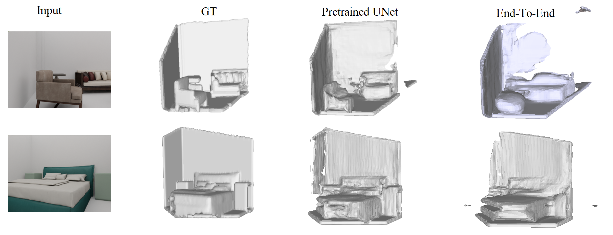

# 3D Reconstruction from a Single RGB Image




## Description
In this work, we are focusing on reconstructing scenes from a single image. We make use of IF-Net which focuses on shape completion from an incomplete 3D input. We explore the usage of IF-Net in the task of 3D reconstruction from images. We also explore its ability to work on complex scenes instead of simple shapes as was proposed in the paper. For more details, please check the full [report](3D_Reconstruction_from_a_Single_RGB_Image_report.pdf) and [presentation](presentation.pdf) of the project.

For a brief 'Real-World-Experiment' see the test-report of the proposed architecture, note however that we used a more powerful depth regressor here [test-report](https://github.com/nihalsid/single-view-3d-reconstruction/blob/main/3d-Scene%20real%20world.pdf).

## Installation
A linux system with cuda 9.0 is required.

Install the dependencies with conda using the `3d-recon_env.yml` file :
```
conda env create -f 3d-recon_env.yml
conda activate 3d-recon
```
Clone the repository and navigate into it in the terminal.

Install libmesh needed libraries with:
```
cd data_processing/libmesh/
python setup.py build_ext --inplace
cd ../..
```
## Dataset
In this work, we used [3D-Front](https://tianchi.aliyun.com/specials/promotion/alibaba-3d-scene-dataset) dataset.

## References

#### This project uses code from the following projects:
+ [IF-Nets](https://github.com/jchibane/if-net) by [Chibane et. al. 2020] 
+ [SynSin](https://github.com/facebookresearch/synsin) by [Olivia Wiles et al. 2019]
+ [point clouds](https://github.com/puhsu/point_clouds) by puhsu
+ [Occupancy Networks](https://github.com/autonomousvision/occupancy_networks) by [Mescheder et. al. CVPR'19] 
+ [DISN](https://github.com/Xharlie/DISN) by [Xu et. al. NeurIPS'19]

#### This project is mainly adapted from the following papers:
+ [IF-Nets](https://arxiv.org/abs/2003.01456) by [Chibane et. al. 2020] 
+ [Unsupervised learning of shape and pose with differentiable point clouds](https://arxiv.org/abs/1810.09381) by [Eldar Insafutdinov and Alexey Dosovitskiy 2018]
+ [SynSin: End-to-end View Synthesis from a Single Image](https://arxiv.org/abs/1912.08804) by [Olivia Wiles et al. 2019]
